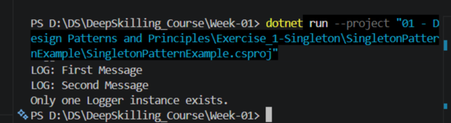

# Singleton Pattern Example

## 📖 Overview

This exercise demonstrates the implementation of the **Singleton Design Pattern** in C#. The Singleton Pattern ensures that a class has only one instance throughout the application's lifecycle while providing a global point of access to that instance.

---

## 🎯 Scenario

A logging utility is required to maintain a **single shared instance** across the application to ensure consistent logging and efficient resource utilization.

---

## 🎯 Objective

- Understand the Singleton Design Pattern.
- Restrict object creation to a single instance.
- Provide global access to the instance.
- Verify that multiple requests return the same object.

---

## 🛠 Project Structure

```
SingletonPatternExample
│
├── SingletonPatternExample.cs
├── SingletonPatternExample.csproj
├── image.png
└── README.md
```

---

## 📂 Files

| File | Description |
|------|-------------|
| SingletonPatternExample.cs | Contains the Logger Singleton implementation and test code |
| SingletonPatternExample.csproj | Project configuration |
| image.png | Output screenshot |
| README.md | Project documentation |

---

## 💡 Concepts Covered

- Singleton Design Pattern
- Private Constructor
- Static Instance
- Lazy Initialization
- Global Access Point
- Object-Oriented Programming

---

## ▶️ Implementation Steps

1. Created the Logger class.
2. Declared a private static instance.
3. Made the constructor private.
4. Implemented the `GetInstance()` method.
5. Verified that only one object is created.

---

## ✅ Expected Output

The program confirms that both object references point to the same Logger instance.

---

## 📸 Output

> Refer to **image.png**

---

## 🏆 Learning Outcome

Successfully implemented the Singleton Pattern and understood how it controls object creation while ensuring only one instance exists.

### Module Overview

